# 实验室设备管理系统

#### 有问题，或者不会调试运行的同学, 可以添加微信（备注项目）：xzxj0206

## 一、介绍

基于JSP+Spring+Struts+Hibernate的实验室设备管理系统

本系统根据角色权限分为3大模块，即使用对象分别为实验室管理教师、普通教师与学生的3大模块

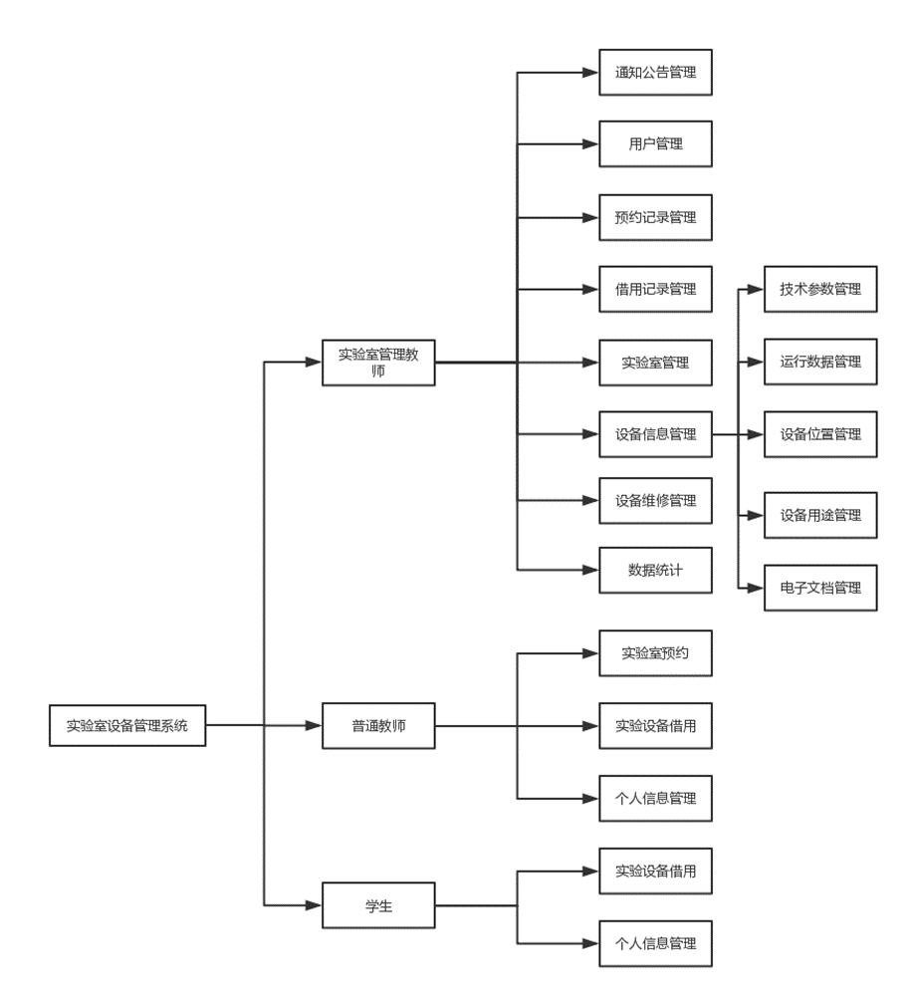

## 二、系统运行界面

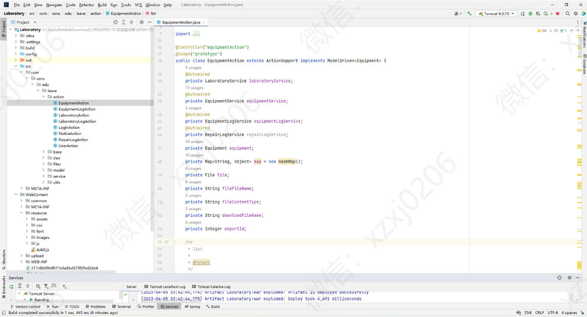

## 三、系统功能部分页面展示

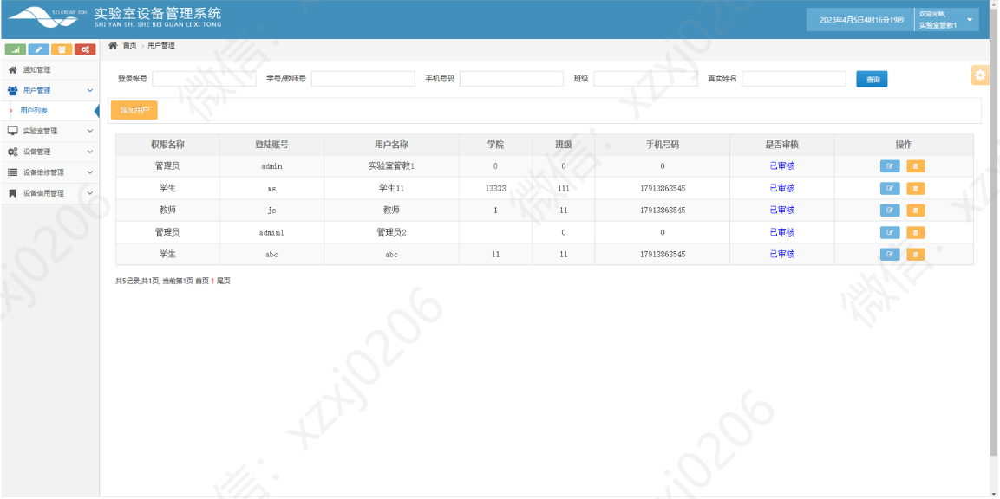

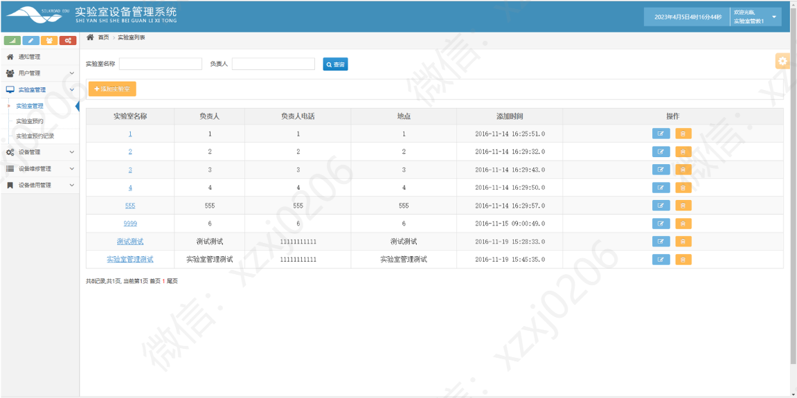

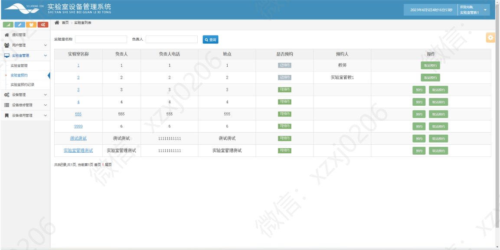

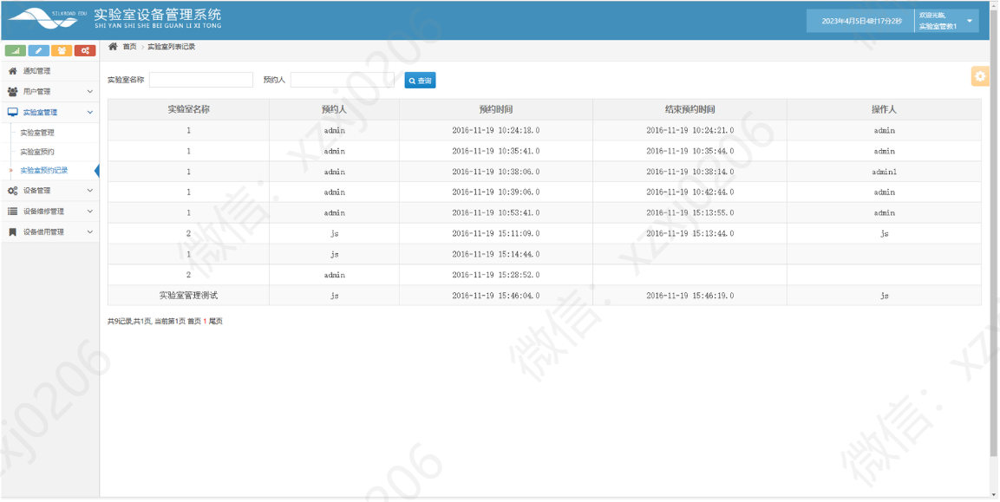

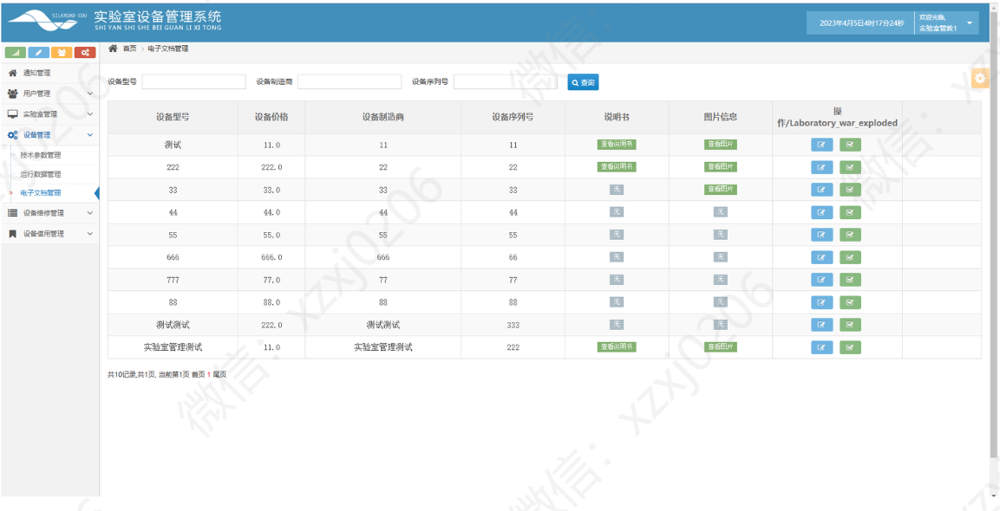

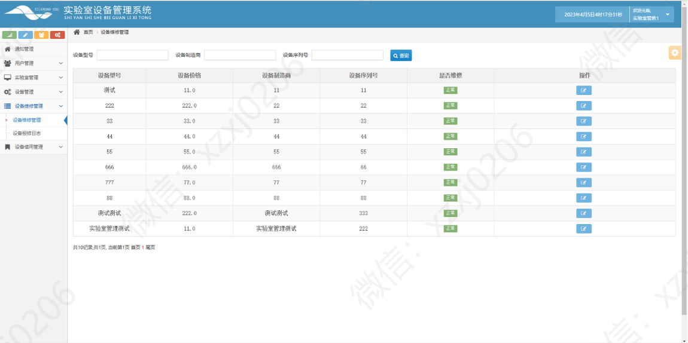

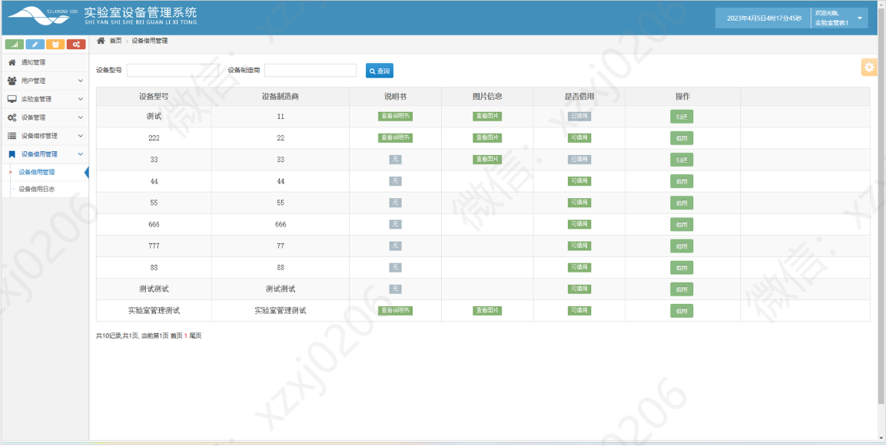

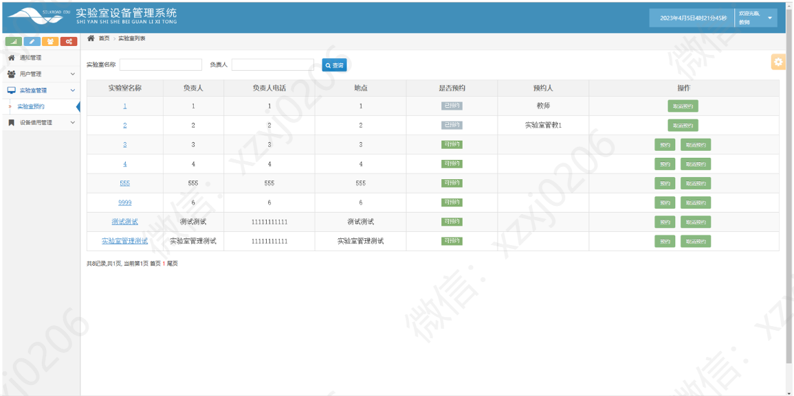

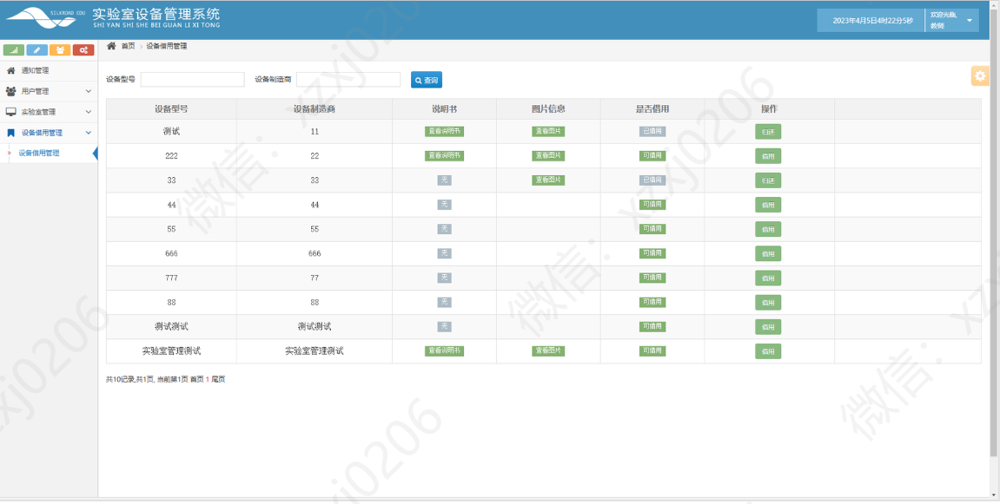

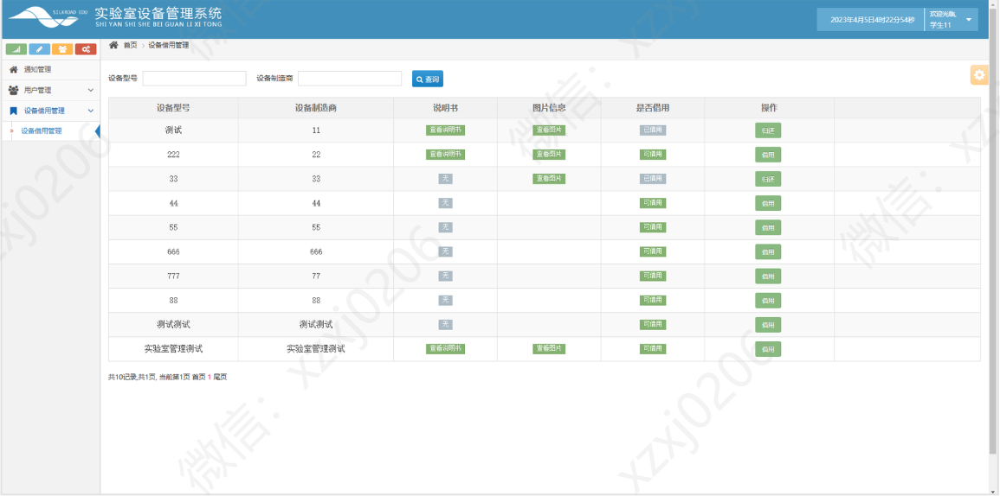
